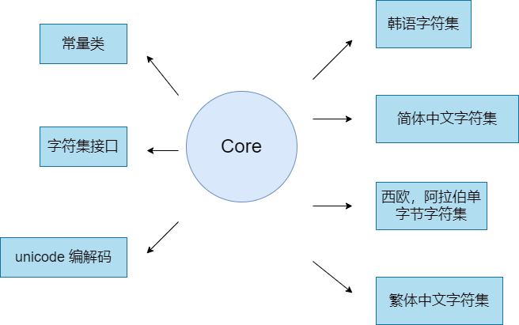

<div align="center">
<h1> charset </h1>
</div>

<p align="center">


</p>

##  简介

仓颉语言编解码库。基于 [WHATWG 字符编码标准](http://encoding.spec.whatwg.org/) 

### 特性

+ 🚀 只有两种方式获取字符集Charset

  + 通过 Charsets 的常量获取，例如： Charsets.utf8 
  + 通过 Charsets 的forName 方法获取， 比如 Charsets.forName("UTF-8")

- 🚀 通过 Charset 创建编码解码器

+ 💪 待开发特性
  + 增加bom支持

##     架构

### 架构图：

<p align="center">

</p>

- 将字节数组转成String对象
  
解码器提供了下面两个方法，能够将字节数组转成String对象
```
func decode(src:Array<UInt8>):String
func decode(src:Array<UInt8>, dest:Array<Char>): (Int64, Int64)
```
io流（包含文件流、网络流）读取的都是字节数组，要将字节数组转成String，就需要上面2个方法。每种字符集的解码方法各不相同

- 将String转成字节数组

要将String写入到io流，需要将String转成字节数组，此时就需要编码器，
编码器提供了编码方法，能将String转成字节数组，传统字符集的字符数量小于unicode， 一些字符在传统字符集中没有，
从unicode(String)编码到传统字符集，会将没有的字符替换成其它（如：0xF3）字节
```
func encode(str:String): Array<UInt8>
```

+ 字符集分类

  + unicode。 仓颉的String是Char数组，一个Char是32位，表示一个unicode代码点。仓颉的String转utf8,utf16le, utf16be,utf32都可以通过计算得到编码
  + 简体中文，如gbk, 无法通过计算与unicode互相转化，需要维护一个gbk代码点与unicode代码点映射表，通过查表方式去转化
  + 繁体中文，big5, 无法通过计算与unicode互相转化，需要维护一个big5代码点与unicode代码点映射表，通过查表方式去转化
  + 韩语，EUC-KR， 需要映射表
  + 日语，需要映射表
  + 阿拉伯语，拉丁语等等这些字符数量少于256，一个字节就能保存下来的字符集。这些字符集有个特点，代码点小于128的与ascii相同，无需转码。128~256的字符转码unicode需要查表

### 源码目录：

```
├── LICENSE
├── README.md
├── doc
│   ├── cjcov
│   └── 字符集简介.md
├── module.json
├── src
│   └── charset
│       ├── charsets.cj     // 常量类，提供forName方法根据字符集名称获取字符集类型，并提供所有支持的字符集常量
│       ├── encoding        // 字符集接口
│       │   ├── charset.cj
│       │   ├── decoder.cj
│       │   └── encoder.cj
│       ├── japanese        // 日语字符集编码实现
│       │   ├── eucjp.cj
│       │   ├── jis0208_mapping.cj
│       │   ├── jis0212_mapping.cj
│       │   ├── jp_charset.cj
│       │   └── shift_jis.cj
│       ├── korean          // 韩语字符集编码实现
│       │   ├── euc_kr_mapping.cj
│       │   └── euckr.cj
│       ├── simplechinese   // 简体中文字符集编码实现
│       │   ├── gb18030_charset.cj
│       │   ├── gb18030_decoder.cj
│       │   ├── gb18030_encoder.cj
│       │   ├── gb18030_mapping.cj
│       │   └── gb18030_ranges_mapping.cj
│       ├── singlebyte      //  西欧、阿拉伯单字节字符集编解码实现
│       │   ├── ibm866_mapping.cj
│       │   ├── iso_8859_10_mapping.cj
│       │   ├── ......
│       │   ├── windows_874_mapping.cj
│       │   └── x_mac_cyrillic_mapping.cj
│       ├── traditionchinese  // 繁体中文字符集编解码实现
│       │   ├── big5.cj
│       │   └── big5_mapping.cj
│       └── unicode           // unicode 编解码实现
│           ├── utf16.cj
│           ├── utf32.cj
│           └── utf8.cj
```

- `doc`是库的设计文档、提案、库的使用文档
- `src`是库源码目录
- `test`是存放测试用例，包括HLT用例、LLT 用例和UT用例
- `generate`是代码生成器，用来生成映射表

### 接口说明

主要是核心类和成员函数说明

#### class TextReader

```
public init(input:InputStream, charset!:Charset = Charsets.UTF8, bufSize!:Int64 = 8192)
public func readln(): Option<String>
```
#### class Charset

```
public func nameEquals(name:String):Bool
public func newEncoder():Encoder
public func newDecoder():Decoder
```
#### interface Decoder

```
func decode(src:Array<UInt8>):String
func decode(src:Array<UInt8>, srcOffset:Int64, srcLimit:Int64, dest:Array<Char>, destStart:Int64): (Int64, Int64)
```
#### interface Encoder

```
func encode(str:String): Array<UInt8>
```

#### class Charsets

```
// UTF-8
public static let utf8:Charset = newUTF8Charset()
// utf-16 be
public static let utf16be:Charset = newUTF16Charset(true)
// utf16 le
public static let utf16le:Charset = newUTF16Charset(false)
// utf32 be
public static let utf32be:Charset = newUTF32Charset(true)
// utf32 le
public static let utf32le:Charset = newUTF32Charset(false)
// gb18030
public static let gb18030:Charset = newGB18030Charset()
// EUC-KR
public static let euckr:Charset = newEUCKRCharset()
// EUC-JP
public static let eucjp:Charset = newEUCJPCharset()
// ShiftJIS
public static let shift_jis:Charset = newShiftJISCharset()
// Big5
public static let big5:Charset = newBIG5Charset()

// IBM866
public static let ibm866:Charset = newSingleByteCharset("IBM866")
// ISO-8859-2
public static let iso_8859_2:Charset = newSingleByteCharset("ISO-8859-2")
// ISO-8859-3
public static let iso_8859_3:Charset = newSingleByteCharset("ISO-8859-3")
// ISO-8859-4
public static let iso_8859_4:Charset = newSingleByteCharset("ISO-8859-4")
// ISO-8859-5
public static let iso_8859_5:Charset = newSingleByteCharset("ISO-8859-5")
// ISO-8859-6
public static let iso_8859_6:Charset = newSingleByteCharset("ISO-8859-6")
// ISO-8859-7
public static let iso_8859_7:Charset = newSingleByteCharset("ISO-8859-7")
// ISO-8859-8
public static let iso_8859_8:Charset = newSingleByteCharset("ISO-8859-8")
// ISO-8859-10
public static let iso_8859_10:Charset = newSingleByteCharset("ISO-8859-10")
// ISO-8859-13
public static let iso_8859_13:Charset = newSingleByteCharset("ISO-8859-13")
// ISO-8859-14
public static let iso_8859_14:Charset = newSingleByteCharset("ISO-8859-14")
// ISO-8859-15
public static let iso_8859_15:Charset = newSingleByteCharset("ISO-8859-15")
// ISO-8859-16
public static let iso_8859_16:Charset = newSingleByteCharset("ISO-8859-16")
// KOI8-R
public static let koi8_r:Charset = newSingleByteCharset("KOI8-R")
// KOI8-U
public static let koi8_u:Charset = newSingleByteCharset("KOI8-U")
// macintosh
public static let macintosh:Charset = newSingleByteCharset("macintosh")
// windows-874
public static let windows_874:Charset = newSingleByteCharset("windows-874")
// windows-1250
public static let windows_1250:Charset = newSingleByteCharset("windows-1250")
// windows-1251
public static let windows_1251:Charset = newSingleByteCharset("windows-1251")
// windows-1252
public static let windows_1252:Charset = newSingleByteCharset("windows-1252")
// windows-1253
public static let windows_1253:Charset = newSingleByteCharset("windows-1253")
// windows-1254
public static let windows_1254:Charset = newSingleByteCharset("windows-1254")
// windows-1255
public static let windows_1255:Charset = newSingleByteCharset("windows-1255")
// windows-1256
public static let windows_1256:Charset = newSingleByteCharset("windows-1256")
// windows-1257
public static let windows_1257:Charset = newSingleByteCharset("windows-1257")
// windows-1258
public static let windows_1258:Charset = newSingleByteCharset("windows-1258")
// x-mac-cyrillic
public static let x_mac_cyrillic:Charset = newSingleByteCharset("x-mac-cyrillic")  
public static func forName(name:String):Option<Charset>
```

##  编译运行

### 编译

```
cpm build

# 单元测试
cpm test test/UT/
```

### 示例1

```cangjie
from charset import charset.*

main() {
    var f:File = File("doc/字符集简介gbk.md", AccessMode.Read, OpenMode.Open)
    
    var sr = TextReader(f, charset: Charsets.gb18030, bufSize:120)
    while(true){
        var lineOp:Option<String> = sr.readln()
        if(lineOp == None){
            break
        }
        let line = lineOp.getOrThrow()
        println("${line}")
    }   
    0
}
```

### 示例2

```cangjie
from charset import charset.*

main() {
    var charset = Charsets.gb18030
    var decoder = charset.newDecoder()
    var encoder = charset.newEncoder() 
    var src: Array<UInt8> = Array<UInt8>([0xCB, 0xAE, 0xB5, 0xE7, 0xB7, 0xD1])
    var destStr = decoder.decode(src)    
    if(destStr == "水电费"){
        return 0
    }else{
        return 1
    }
}
```

## 参与贡献

[@freeonsky](https://gitee.com/freeonsky)
